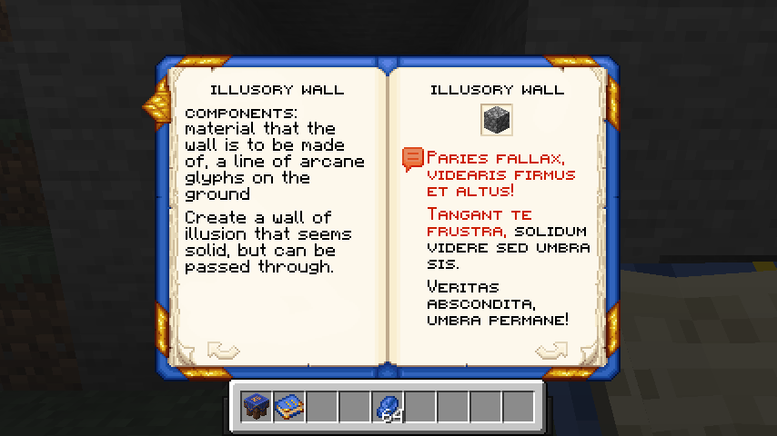

# Magisterium

Construct your own spell book from the magical pages scattered around the world! 

It's made as an entry to Modfest 1.21, although not particularly on theme, which is "Time, Technology & Throwbacks". It may not look like one to you, bit it *is* a throwback - a throwback to Modfest 1.17, when I had the idea for book centered magic mod, yet had abandoned it.

I didn't see how it all could fit together to make a fun experience, but now (= three years later), halfway through the current modfest, the idea finished cooking in my head, and I felt like working on it. So, let's cast some spells!

## Overview

The mod is centered on using spell books, which double as a container for the spell pages and as an actual book you can read and use to cast the spells within. 

**Spell Pages** are found in the world, currently as loot in dungeons, desert and jungle temples and strongholds.

They can be inserted into a spell book in the **Arcane Table**, alongside some utilities like **Bookmarks**.

Then, use the spell book to read about the spell, fill ingredients and comply with the requirements, if any, and hold the chant button!

A number of spells require **Arcane Glyphs** to be placed on the ground, which will define the area of effect of the spell. 
Simply right click with Lapis Lazuli on the ground to place them.

Woila! You've cast a spell!

